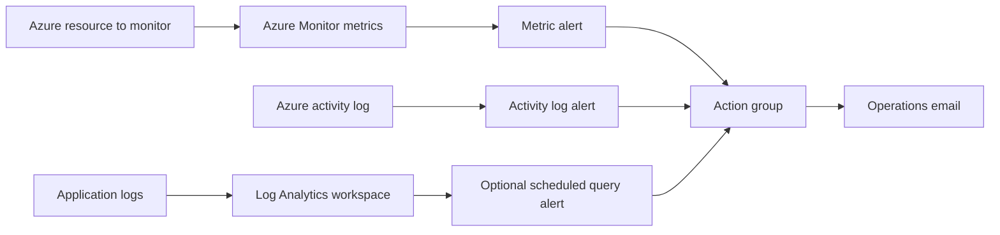

# Azure Monitoring and Alerting Automation

This project is a real-world Azure Monitor deployment runbook. It uses Terraform to create monitoring resources, alert rules, and notification routing, then gives you scripts and GitHub Actions automation to deploy the same setup repeatedly across environments.

## What You Will Build

- Azure resource group for monitoring resources
- Log Analytics workspace
- Azure Monitor action group with email notification
- Metric alert for a real Azure resource, such as a VM CPU alert
- Activity log alert for resource group delete operations
- Optional scheduled query alert for failed application requests
- KQL investigation queries
- Local PowerShell deployment scripts
- GitHub Actions deployment workflow with Azure OpenID Connect

## Architecture



## Repository Structure

```text
.
├── .github/workflows/
│   ├── deploy-monitoring.yml
│   └── terraform-validate.yml
├── queries/
│   ├── action-group-notifications.kql
│   ├── alert-review.kql
│   ├── failed-requests.kql
│   └── vm-cpu-investigation.kql
├── scripts/
│   ├── bootstrap-tfstate.ps1
│   ├── configure-github-oidc.ps1
│   ├── deploy-alerts.ps1
│   └── get-resource-id.ps1
└── terraform/
    ├── backend.hcl.example
    ├── backend.tf
    ├── main.tf
    ├── outputs.tf
    ├── providers.tf
    ├── terraform.tfvars.example
    └── variables.tf
```

## Prerequisites

Install these tools:

- Azure CLI
- Terraform 1.6 or later
- Git
- PowerShell 7 or Windows PowerShell

You need Azure permissions to create:

- Resource groups
- Log Analytics workspaces
- Azure Monitor alert rules
- Action groups
- Role assignments and Microsoft Entra app registrations if you use GitHub Actions OIDC

## Step 1: Clone the Repository

```powershell
git clone https://github.com/michaelakorede/azure-monitoring-alerting-automation.git
cd azure-monitoring-alerting-automation
```

## Step 2: Sign In to Azure

```powershell
az login
az account show --output table
```

If needed, select the right subscription:

```powershell
az account set --subscription "<subscription-id>"
```

## Step 3: Choose the Azure Resource to Monitor

This project needs a real Azure resource ID for the metric alert. A common first target is an Azure virtual machine because the default metric is `Percentage CPU`.

### Find the Resource ID in Azure Portal

1. Open [Azure Portal](https://portal.azure.com).
2. Go to the resource you want to monitor.
3. Open **Properties**.
4. Copy the **Resource ID**.

The ID should look like this:

```text
/subscriptions/<subscription-id>/resourceGroups/<resource-group>/providers/Microsoft.Compute/virtualMachines/<vm-name>
```

### Find the Resource ID with Azure CLI

List resources in a resource group:

```powershell
.\scripts\get-resource-id.ps1 -ResourceGroupName "<resource-group-name>"
```

Filter by name:

```powershell
.\scripts\get-resource-id.ps1 `
  -ResourceGroupName "<resource-group-name>" `
  -Name "<resource-name>"
```

## Step 4: Deploy Monitoring Locally

For a real project, create a remote Terraform state backend first:

```powershell
.\scripts\bootstrap-tfstate.ps1 -Environment dev -Location eastus
```

This creates an Azure Storage Account and writes `terraform/backend.hcl`. The local deployment script will automatically use that backend file when it exists. If `backend.hcl` does not exist, the script falls back to local Terraform state for quick testing.

Run the deployment script:

```powershell
.\scripts\deploy-alerts.ps1 `
  -Environment dev `
  -Location eastus `
  -TargetResourceId "/subscriptions/<subscription-id>/resourceGroups/<resource-group>/providers/Microsoft.Compute/virtualMachines/<vm-name>" `
  -OpsEmail "cloud-ops@example.com"
```

The script runs:

- `terraform init`
- `terraform fmt`
- `terraform validate`
- `terraform plan`
- `terraform apply`
- `terraform output`

It also writes useful output values to `.deploy.env`.

To skip the apply confirmation prompt:

```powershell
.\scripts\deploy-alerts.ps1 `
  -TargetResourceId "<resource-id>" `
  -OpsEmail "cloud-ops@example.com" `
  -AutoApprove
```

## Step 5: Deploy Manually with Terraform

```powershell
cd terraform
copy terraform.tfvars.example terraform.tfvars
```

Edit `terraform.tfvars`:

```hcl
environment        = "dev"
location           = "eastus"
target_resource_id = "/subscriptions/<subscription-id>/resourceGroups/<resource-group>/providers/Microsoft.Compute/virtualMachines/<vm-name>"
ops_email          = "cloud-ops@example.com"
```

Then deploy:

```powershell
terraform init
terraform fmt
terraform validate
terraform plan -out monitoring.tfplan
terraform apply monitoring.tfplan
terraform output
```

## Step 6: Review the Deployment in Azure Portal

Open [Azure Portal](https://portal.azure.com), then:

1. Go to **Resource groups**.
2. Open `rg-monitor-dev`.
3. Confirm the Log Analytics workspace exists.
4. Confirm the action group exists.
5. Search for **Alerts**.
6. Open **Alert rules**.
7. Confirm the metric alert exists.
8. Confirm the activity log alert exists.
9. Open the action group and verify the email receiver.

Azure sends a confirmation email to the action group email address. Confirm it so notifications are delivered.

## Step 7: Configure GitHub Actions Deployment

The workflow `.github/workflows/deploy-monitoring.yml` can deploy this project from GitHub Actions using Azure OpenID Connect.

Run this script once:

```powershell
.\scripts\configure-github-oidc.ps1 `
  -GitHubOwner "michaelakorede" `
  -GitHubRepo "azure-monitoring-alerting-automation" `
  -Environment dev
```

The script creates:

- Microsoft Entra app registration
- Service principal
- Federated credential for the `main` branch
- Contributor role assignment

For tighter production security, pass `-RoleAssignmentScope` with a narrower scope instead of subscription scope.

## Step 8: Create GitHub Secrets and Variables

In GitHub:

1. Open the repository.
2. Go to **Settings**.
3. Go to **Secrets and variables**.
4. Select **Actions**.

Create these repository secrets:

| Secret | Value |
| --- | --- |
| `AZURE_CLIENT_ID` | App/client ID from `configure-github-oidc.ps1` |
| `AZURE_TENANT_ID` | Azure tenant ID |
| `AZURE_SUBSCRIPTION_ID` | Azure subscription ID |
| `MONITOR_OPS_EMAIL` | Operations email address |

Create this repository variable:

| Variable | Value |
| --- | --- |
| `MONITOR_TARGET_RESOURCE_ID` | Full Azure resource ID to monitor |

Create these repository variables for remote Terraform state. The `bootstrap-tfstate.ps1` script prints these values:

| Variable | Value |
| --- | --- |
| `TF_STATE_RESOURCE_GROUP` | Terraform state resource group |
| `TF_STATE_STORAGE_ACCOUNT` | Terraform state storage account |
| `TF_STATE_CONTAINER` | Terraform state blob container |
| `TF_STATE_KEY` | Terraform state key, for example `azure-monitoring-alerting-automation/dev.tfstate` |

## Step 9: Run the GitHub Actions Deployment

1. Open GitHub.
2. Go to **Actions**.
3. Select **Deploy Azure Monitoring**.
4. Select **Run workflow**.
5. Keep `auto_apply` as `false` for the first run.
6. Review the Terraform plan logs.
7. Run it again with `auto_apply` set to `true` when the plan is correct.

## Optional: Change the Metric Alert

The default alert monitors VM CPU:

```hcl
metric_namespace = "Microsoft.Compute/virtualMachines"
metric_name      = "Percentage CPU"
metric_threshold = 80
```

For another Azure resource, update these values to match that resource's Azure Monitor metric namespace and metric name.

Examples:

| Resource | Metric namespace | Metric example |
| --- | --- | --- |
| Virtual machine | `Microsoft.Compute/virtualMachines` | `Percentage CPU` |
| App Service | `Microsoft.Web/sites` | `CpuPercentage` |
| Storage account | `Microsoft.Storage/storageAccounts` | `Availability` |

## Optional: Enable Failed Request Log Alert

The failed request scheduled query alert is disabled by default because a new Log Analytics workspace may not have application request logs yet.

Enable it only after your application sends request telemetry to the workspace:

```hcl
enable_failed_request_log_alert = true
failed_request_threshold        = 5
```

The alert uses:

```text
queries/failed-requests.kql
```

## Useful KQL Queries

Run these in the Log Analytics workspace:

```text
queries/vm-cpu-investigation.kql
queries/failed-requests.kql
queries/action-group-notifications.kql
queries/alert-review.kql
```

## Verification Checklist

- Resource group `rg-monitor-dev` exists.
- Log Analytics workspace exists.
- Action group contains the correct email receiver.
- Common alert schema is enabled on the email receiver.
- Metric alert is enabled and points to the target resource.
- Activity log alert is enabled.
- GitHub Actions workflow can run `terraform plan`.
- Operations email has confirmed Azure Monitor notification email.

## Troubleshooting

### Terraform Fails Because the Resource ID Is Invalid

Confirm the ID starts with `/subscriptions/` and includes `/providers/`.

```powershell
az resource show --ids "<resource-id>" --output table
```

### No Alert Emails Arrive

Check:

- The action group email receiver is correct.
- The recipient confirmed the Azure Monitor email subscription.
- The alert rule is enabled.
- The alert condition actually fired.

### Metric Alert Fails to Create

Confirm the metric namespace and metric name match the target resource:

```powershell
az monitor metrics list-definitions --resource "<resource-id>" --output table
```

### GitHub Actions Cannot Login to Azure

Check these values:

- `AZURE_CLIENT_ID`
- `AZURE_TENANT_ID`
- `AZURE_SUBSCRIPTION_ID`
- Federated credential subject: `repo:michaelakorede/azure-monitoring-alerting-automation:ref:refs/heads/main`

### Scheduled Query Alert Does Not Return Data

Confirm the workspace has the table used by the query. For `failed-requests.kql`, the workspace needs `AppRequests` data.

## Cleanup

To remove all resources created by Terraform:

```powershell
cd terraform
terraform destroy
```

## Real-World Improvements

For production, add:

- Remote Terraform state in Azure Storage
- Separate dev, test, and prod workspaces
- Alert severity standards
- Alert processing rules for maintenance windows
- Webhook or Logic App integration for ticket creation
- Microsoft Teams notification through Logic Apps
- Azure Monitor diagnostic settings on production resources
- Azure Monitor Agent and data collection rules for VM guest logs

## References

- [Azure Monitor alerts overview](https://learn.microsoft.com/azure/azure-monitor/alerts/alerts-overview)
- [Azure Monitor action groups](https://learn.microsoft.com/azure/azure-monitor/alerts/action-groups)
- [Azure Monitor common alert schema](https://learn.microsoft.com/azure/azure-monitor/alerts/alerts-common-schema)
- [Create metric alerts in Azure Monitor](https://learn.microsoft.com/azure/azure-monitor/alerts/tutorial-metric-alert)
- [Use OpenID Connect with GitHub Actions and Azure](https://learn.microsoft.com/azure/developer/github/connect-from-azure-openid-connect)
