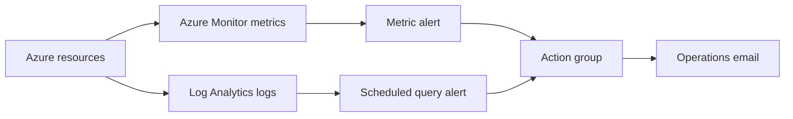

# Azure Monitoring and Alerting Automation

This project automates Azure Monitor alerting for common cloud operations scenarios. It combines Terraform for repeatable deployment, KQL for log-based detection, and a PowerShell wrapper for environment-specific rollout.

## What It Deploys

- Log Analytics workspace
- Azure Monitor action group
- CPU metric alert for a target resource
- Failed request scheduled query alert
- Example KQL queries for incident investigation

## Architecture



## Quick Start

```powershell
./scripts/deploy-alerts.ps1 `
  -Environment dev `
  -Location eastus `
  -TargetResourceId "/subscriptions/<sub>/resourceGroups/<rg>/providers/Microsoft.Compute/virtualMachines/<vm>" `
  -OpsEmail "cloud-ops@example.com"
```

## Portfolio Talking Points

- Demonstrates alerting as code rather than portal-only configuration.
- Uses both metric and log alert patterns.
- Separates reusable KQL from deployment code.
- Makes notification targets configurable for each environment.

